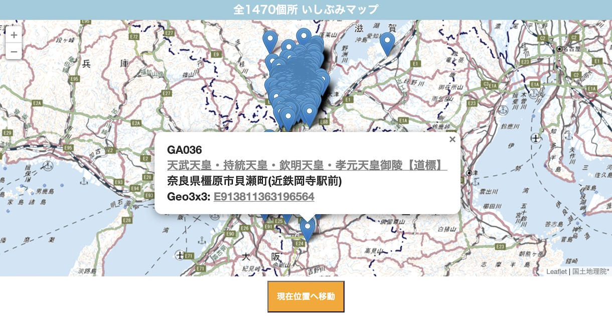

# Kyoto Ishibumi Map (いしぶみマップ)

京都市および周辺地域にある1,470基の石碑（いしぶみ）を表示するインタラクティブなウェブマップです。京都市のオープンデータと[egmapjs](https://github.com/code4fukui/egmapjs)ライブラリを使用して構築されています。



## デモ

**[https://code4fukui.github.io/kyotoishibumi/](https://code4fukui.github.io/kyotoishibumi/)**

## 機能

-   **インタラクティブマップ**: 1,470基の石碑の位置を表示します。
-   **詳細情報**: 石碑のアイコンをクリックすると、以下の情報を含むポップアップが表示されます。
    -   公式の石碑番号
    -   名称（京都市公式詳細ページへのリンク）
    -   住所
    -   [Geo3x3](https://taisukef.github.io/Geo3x3/) 位置コード（Geo3x3マップへのリンク）
-   **現在地表示**: 「現在位置へ移動」ボタンをクリックすると、マップの中心が現在の位置に移動します。

## データソース

このアプリケーションは、[京都市オープンデータポータルサイト](https://data.city.kyoto.lg.jp/node/14455)が提供する「いしぶみリスト」を使用しています。

元のソースからデータを取得する際のブラウザのCORS（Cross-Origin Resource Sharing）エラーを回避するため、本リポジトリにはデータのローカルコピーである [ishibumi-data-281211.csv](ishibumi-data-281211.csv) が同梱されており、アプリケーションではこちらを使用しています。

## はじめに（ローカル開発）

本アプリはローカルで実行可能な静的ウェブアプリケーションです。ブラウザのセキュリティポリシー上、ESモジュールのインポートを正しく処理するためにローカルWebサーバーが必要になります。

1.  **リポジトリのクローン:**
    ```sh
    git clone https://github.com/code4fukui/kyotoishibumi.git
    cd kyotoishibumi
    ```

2.  **ローカルWebサーバーの起動:** Pythonがインストールされている場合は、以下のコマンドを使用できます。
    ```sh
    # Python 3
    python -m http.server
    ```
    Node.jsの場合は、`http-server`などのパッケージを使用できます。
    ```sh
    npx http-server
    ```

3.  **アプリケーションを開く:** サーバーによって提供されたURL（例: `http://localhost:8000`）にブラウザでアクセスします。

## クレジット

-   **アプリ:** [全1470個所 いしぶみマップ](https://fukuno.jig.jp/3151) CC BY Taisuke Fukuno ([@taisukef](https://github.com/taisukef))
-   **データ:** [CC BY いしぶみリスト | 京都市オープンデータポータルサイト](https://data.city.kyoto.lg.jp/node/14455)
-   **ライブラリ:** [egmapjs](https://github.com/code4fukui/egmapjs) (MIT License)

## ライセンス

本プロジェクトは [MIT License](LICENSE) のもとで公開されています。
